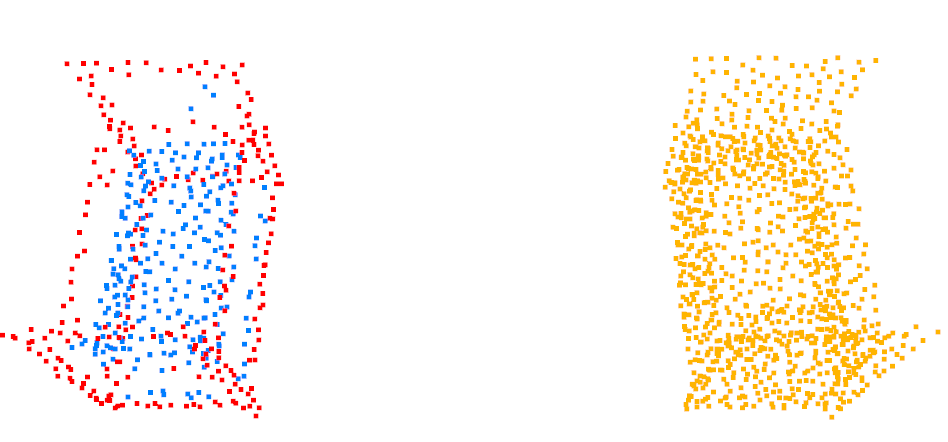

# Brief
Extract sharp and gentle variation part from point cloud, method from [GDANet](https://github.com/mutianxu/GDANet).

* RED: sharp variation part
* BLUE: gentle variation part
* RIGHT: input

Note: this method is not robust enough, especially different number of points.